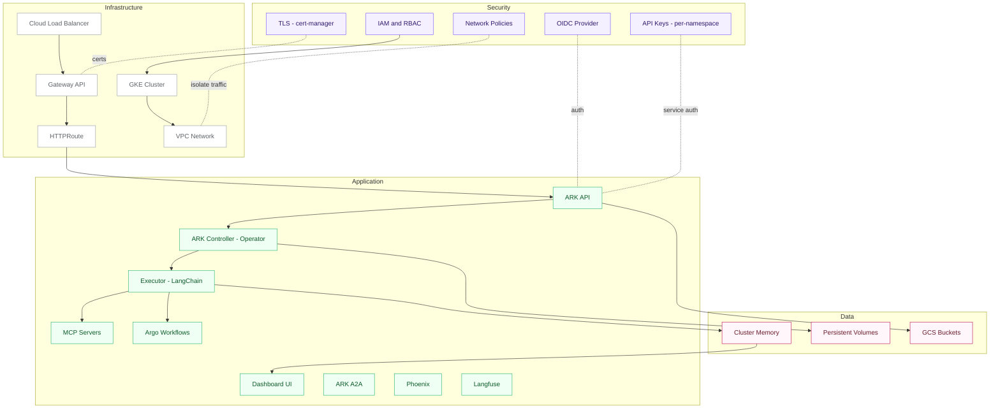
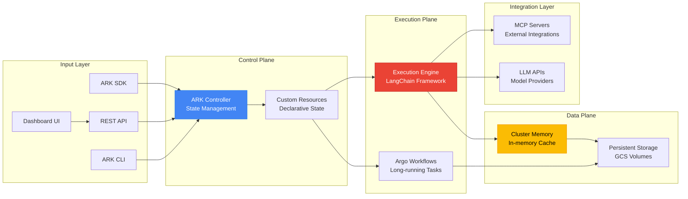
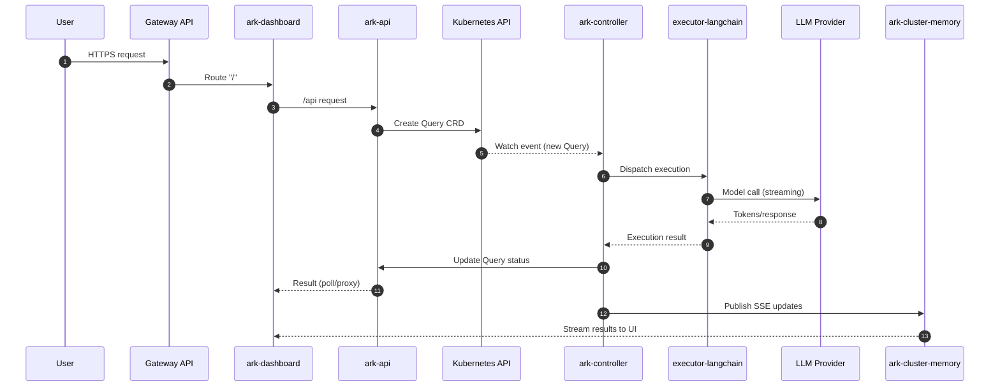
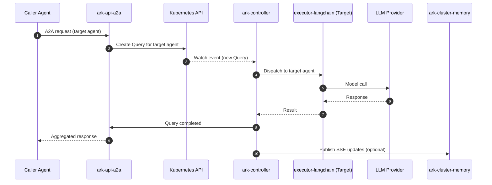
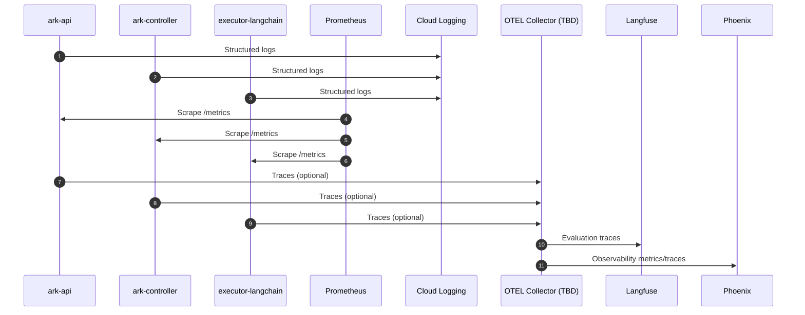
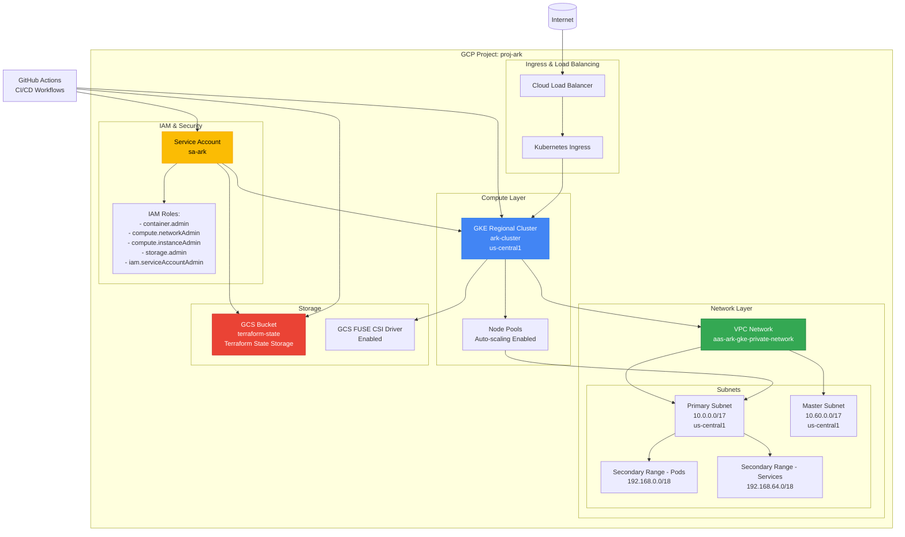
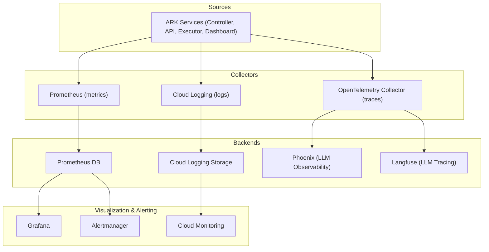
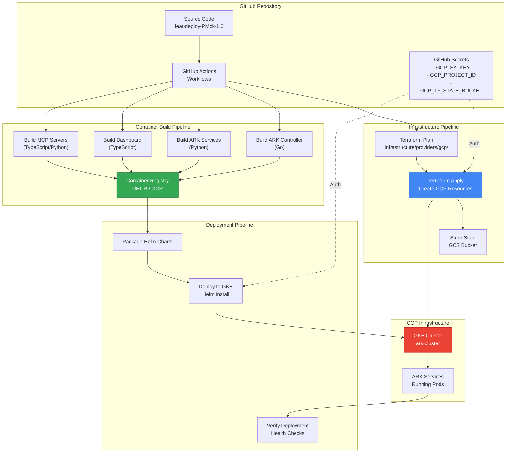

# ARK on GKE

**Document Version:** 1.0  
**Platform:** Google Kubernetes Engine (GKE) - Standard Cluster  
**Cloud Provider:** Google Cloud Platform (GCP)  
**Target Environment:** Production-Ready Agentic AI Platform  

---

## 1. Summary

### What is ARK? 

**Starting with the basics: What is an AI Agent?**

Think of an AI agent like a skilled assistant who can think, use tools, and complete tasks autonomously. Unlike a simple chatbot that just answers questions, an agent can:
- Break down complex goals into smaller steps
- Choose and use the right tools for each step (like searching databases, running code, or calling APIs)
- Remember context across multiple interactions
- Make decisions and adjust its approach based on results

**What is an Agentic AI Runtime?**

Just like applications need an operating system to run, AI agents need a runtime environment. An Agentic AI runtime provides:
- **Infrastructure**: Where agents live and execute (compute, memory, storage)
- **Lifecycle management**: Creating, starting, stopping, and monitoring agents
- **Tool access**: Connecting agents to databases, APIs, and other services
- **Communication**: Enabling agents to work together and share information
- **Security**: Controlling who can create agents and what they can access
- **Observability**: Tracking what agents are doing and how well they perform

**What is ARK?**

ARK (Agentic Runtime on Kubernetes) is a production-grade platform that makes it simple to deploy and operate AI agents at scale. It leverages Kubernetes patterns to provide:
- **Declarative agent definitions**: Describe what you want your agent to do, not how to manage infrastructure
- **Automatic scaling**: Create one agent or thousands, the platform handles the complexity
- **Multi-tenancy**: Different teams can safely run agents in isolated environments
- **Enterprise security**: Built-in authentication, authorization, and network isolation
- **Operational excellence**: Monitoring, logging, and evaluation tools out of the box

In essence, ARK is to AI agents what Kubernetes is to containers—a robust, scalable platform that abstracts away infrastructure complexity and lets you focus on building intelligent, autonomous systems.

---

### Technical Summary

- **Scope**: Combined logical and physical architecture for ARK on a GCP Standard GKE cluster.
- **Tenancy**: Namespace-scoped; API keys are stored per tenant namespace; RBAC isolates access.
- **Ingress**: GKE Gateway API (HTTPS) exposes `ark-dashboard` and `ark-api`.
- **Core Pods (what each runs)**:
  - `ark-controller`: Kubernetes operator (CRDs, reconciliation, admission webhooks, events).
  - `ark-api`: FastAPI REST for ARK CRDs, OIDC/API-key auth.
  - `ark-api-a2a`: Agent-to-Agent gateway (discovery, routing, query creation).
  - `ark-dashboard`: Next.js UI for agents, teams, models, queries.
  - `executor-langchain`: Agent execution engine (LangChain adapter, tools, RAG, LLM calls).
  - `ark-cluster-memory`: In-memory broker with SSE streaming for sessions/updates.
  - `ark-evaluator`: Evaluation service (baseline, LLM-as-judge, RAGAS).
  - `ark-mcp`: MCP server exposing ARK resources as tools.
  - `mcp-filesystem`: MCP filesystem with persistent workspace support.
- **Security**: RBAC per namespace, NetworkPolicies, Pod Security Standards, TLS via cert-manager.
- **Observability**: Cloud Logging, Prometheus ServiceMonitors, optional OpenTelemetry export.
- **Evals Observability**: Langfuse and Phoenix included for evaluation metrics and traces.
- **Costs**: Placeholders only ("-")—region, usage and commitments pending.
- **Note**: All  quantities, replicas, CPU/memory, and storage are variable and will change as scale increases (actual values TBD).

## 2. Architecture Overview

### Infrastructure Layer (GCP)
- **Regional GKE Cluster** in us-central1
- **Private VPC** with custom subnet configuration
- **Auto-scaling node pools** for cost optimization
- **GCS buckets** for Terraform state and backups
- **Service Account** with least-privilege IAM roles

### Application Layer (ARK)
- **ARK Controller** - Go-based Kubernetes operator managing custom resources
- **API Services** - Python FastAPI services for REST and A2A communication
- **Dashboard** - Next.js React web interface
- **Execution Engine** - LangChain-based agent execution
- **Storage** - In-memory cluster memory with SSE streaming
- **Evaluation** - Model quality assessment and metrics

### Security & Compliance
- Private cluster with no public endpoints
- RBAC policies per namespace
- Agentic IAM - TBD

### Operations & Monitoring
- Prometheus for metrics collection
- Cloud Logging for centralized logs
- Phoenix/Langfuse for LLM observability
- Alert Manager for incident response - SRE only
- Auto-scaling (HPA + Cluster Autoscaler)
- Automated backups and disaster recovery - TBD

### 2.1 High Level Layered Architecture

### 2.2 Data Flow Architecture

### 2.3 Primary Flows

#### User Query Execution

--- 

#### Agent-to-Agent (A2A) Flow

--- 

#### Observability and Evals Flow

## 3. Infrastructure Architecture (GCP)

### 3.1 GKE Cluster Specs

**Cluster Type:** GCP Standard Cluster 

| Component | Specification | Quantity | Unit Cost | Extended Cost |
|-----------|---------------|----------|-----------|---------------|
| **System Node Pool** | n2-standard-4 (4 vCPU, 16GB) | - | - | - |
| **Workload Node Pool** | n2-standard-8 (8 vCPU, 32GB) | - | - | - |
| **GKE Management Fee** | Standard cluster | - | - | - |

**Cluster Features Required:**
- Cluster Mode: Standard
- Cloud Logging: Enabled
- Cloud Monitoring: Enabled
- Persistent Volume: Attached

### 3.2 GCP Resources

| Resource               | Purpose                 | Notes                                           |
|------------------------|------------------------|-------------------------------------------------|
| GKE (regional)         | Cluster control plane   | Standard cluster                                |
| Load balancing & ingress | Traffic entry         | External HTTP(S) / Gateway API                  |
| Artifact Registry      | Container images        | Registry for builds                             |
| Storage (GCS)          | State, logs, backups   | Buckets as needed                               |
| PersistentVolume / PVC | Persistent storage     | Backed by GCP Persistent Disks (pd-ssd, pd-standard); used by mcp-filesystem, ark-cluster-memory, and vector database |
| Secret Manager         | Centralized secrets     | API keys, credentials                           |
| Monitoring & Logging   | Observability           | Cloud Monitoring/Logging                        |

### 3.3 Namespace Structure

| Namespace | Purpose | Resource Quota (CPU) | Resource Quota (Memory) |
|-----------|---------|----------------------|-------------------------|
| `ark-system` | Control plane components | - | - |
| `ark-services` | Platform services | - | - |
| `ark-executors` | Execution engines | - | - |
| `ark-marketplace` | Observability (Langfuse, Phoenix) | - | - |
| `[tenant-*]` | Multi-tenant workloads | - | - |
| `default` | ARK Resources [ Agents ] | - | - |

### 3.4 Component Responsibilities Matrix

| Component | Primary Function | Key Responsibilities | Dependencies |
|-----------|------------------|----------------------|--------------|
| **ark-controller** | Kubernetes Operator | CRD reconciliation (Agent, Query, Team, Model, Tool, Memory), admission webhooks, event recording, leader election | Kubernetes API, executor-langchain |
| **ark-api** | REST API Gateway | CRUD operations on ARK CRDs, OIDC/API key authentication, OpenAPI documentation, API key management | Kubernetes API |
| **ark-api-a2a** | Agent-to-Agent Communication | Agent discovery, message routing, Query CRD creation, blocking/non-blocking task execution | Kubernetes API, ark-controller |
| **ark-dashboard** | Web UI | Resource management UI, OIDC authentication, real-time query updates via SSE | ark-api |
| **executor-langchain** | Execution Engine | LangChain adapter, tool orchestration, RAG support, LLM API calls, streaming responses | LLM providers, ark-mcp, mcp-filesystem |
| **ark-cluster-memory** | Message Broker | In-memory pub/sub, SSE streaming, session state management, message history | None |
| **ark-evaluator** | Evaluation Service | AI model scoring (baseline, LLM-as-judge, RAGAS), event-driven evaluation, Langfuse integration | LLM providers, ark-controller |
| **ark-mcp** | MCP Server | ARK CRDs as MCP tools, agent discovery via MCP protocol | Kubernetes API |
| **mcp-filesystem** | Filesystem Operations | File CRUD operations, session management, workspace configuration | Persistent storage |

## 4. Storage Resources

### 4.1 PersistentVolumes

| Volume Name | Size | StorageClass | AccessMode | Used By | Purpose |
|-------------|------|--------------|------------|---------|---------|
| **mcp-filesystem-data** | - | pd-standard | ReadWriteOnce | mcp-filesystem | Workspace file storage |
| **ark-cluster-memory-data** | - | pd-ssd | ReadWriteOnce | ark-cluster-memory | Message persistence (optional) |
| **postgres-vectordb-data** | - | pd-ssd | ReadWriteOnce | PostgreSQL | RAG vector storage / Chat  (optional) |

### 4.2 Configuration Storage

| Type | Name | Namespace | Purpose | Size |
|------|------|-----------|---------|------|
| **ConfigMap** | otel-environment-variables | ark-system | OpenTelemetry config (optional) | - |
| **Secret** | otel-environment-variables | ark-system | OTEL credentials (optional) | - |
| **Secret** | llm-provider-keys | ark-services | OpenAI/Azure/Bedrock API keys | - |
| **Secret** | oidc-client-secret | ark-services | OIDC client credentials | - |
| **Secret** | ark-api-keys-* | [tenant namespaces] | API keys per tenant | - |
| **Google Secret Manager** | gsm | - | Centralized secret storage and rotation | - |

---

## 5. Networking

### 5.1 Services 

| Service Name | Type | Namespace | Selector | Ports | Target Component |
|--------------|------|-----------|----------|-------|------------------|
| ark-api | ClusterIP | ark-services | app=ark-api | 80→8000 | ark-api pods |
| ark-api-a2a | ClusterIP | ark-services | app=ark-api-a2a | 80→8000 | ark-api-a2a pods |
| ark-dashboard | ClusterIP | ark-services | app=ark-dashboard | 3000 | ark-dashboard pods |
| ark-cluster-memory | ClusterIP | ark-services | app=ark-cluster-memory | 80→8080 | ark-cluster-memory pod |
| executor-langchain | ClusterIP | ark-executors | app=executor-langchain | 8000 | executor-langchain pods |
| ark-evaluator | ClusterIP | ark-services | app=ark-evaluator | 8000 | ark-evaluator pods |
| ark-mcp | ClusterIP | ark-services | app=ark-mcp | 80→8080 | ark-mcp pods |
| mcp-filesystem | ClusterIP | ark-services | app=mcp-filesystem | 80→8080 | mcp-filesystem pod |

### 5.2 Ingress Resources (Gateway API)

| Resource Type | Name | Namespace | Configuration | TLS |
|---------------|------|-----------|---------------|-----|
| **Gateway** | ark-gateway | ark-gateway | GatewayClass: gke-l7-global-external-managed, HTTPS:443 | Yes |
| **HTTPRoute** | ark-dashboard-route | ark-gateway | Host: ark.example.com, Paths: / → ark-dashboard:3000 | Gateway TLS |
| **HTTPRoute** | ark-api-route | ark-gateway | Host: api.ark.example.com, Paths: /v1/* → ark-api:80 | Gateway TLS |

### 5.3 Network Policy 

| Policy Name | Namespace | Applied To | Ingress Rules | Egress Rules |
|-------------|-----------|------------|---------------|--------------|
| ark-api-netpol | ark-services | ark-api | Allow from: ark-dashboard, ark-gateway | Allow to: Kubernetes API |
| ark-controller-netpol | ark-system | ark-controller | Allow from: Kubernetes API (webhooks) | Allow to: Kubernetes API, executor-langchain |
| executor-netpol | ark-executors | executor-langchain | Allow from: ark-controller | Allow to: LLM APIs, ark-mcp, mcp-filesystem, PostgreSQL |
| ark-cluster-memory-netpol | ark-services | ark-cluster-memory | Allow from: ark-api, ark-dashboard, executor-langchain | Deny all |

## 6. Application 

### 6.1 Application Components - Technologies and Tools

| Component | Language/Runtime | Framework/Library | Key Tools | Description |
|-----------|------------------|-------------------|-----------|-------------|
| **ark-controller** | Go 1.21+ | controller-runtime, kubebuilder | Kubernetes API client, admission webhooks, leader election | Kubernetes operator managing ARK CRDs (Agent, Query, Team, Model, Tool, Memory) with reconciliation and validation |
| **ark-api** | Python 3.11+ | FastAPI, Pydantic | Kubernetes Python client, OIDC libraries, bcrypt | REST API gateway for ARK CRDs with OIDC/JWT and API key authentication, OpenAPI documentation |
| **ark-api-a2a** | Python 3.11+ | FastAPI | Kubernetes Python client | Agent-to-Agent gateway implementing A2A protocol for inter-agent communication and discovery |
| **ark-dashboard** | TypeScript/Node.js | Next.js 14+, React, Jotai | shadcn/ui, Tailwind CSS | Web UI for managing ARK resources with real-time updates via Server-Sent Events (SSE) |
| **executor-langchain** | Python 3.11+ | LangChain, OpenAI SDK | HTTP clients, streaming support | Execution engine for agent workflows, tool orchestration, RAG support, and LLM provider integration |
| **ark-cluster-memory** | TypeScript/Node.js | Express.js, EventSource | In-memory data structures | In-memory message broker with SSE streaming for real-time session state and query updates |
| **ark-evaluator** | Python 3.11+ | RAGAS, LLM SDKs | Event-driven architecture | AI model evaluation service supporting baseline, LLM-as-judge, and RAGAS metrics for quality assessment |
| **ark-mcp** | Python 3.11+ | MCP protocol implementation | Kubernetes Python client | Model Context Protocol server exposing ARK CRDs as MCP tools for external integrations |
| **mcp-filesystem** | TypeScript/Node.js | Express.js, file system APIs | Session management, LRU cache | MCP-compliant filesystem server with persistent workspace support and session tracking |

---

## 7. Observability

### 7.1 Monitoring and Observability Stack

### 7.2 ServiceMonitor  (Prometheus)

| ServiceMonitor | Target Service | Endpoint | Scrape Interval | Metrics Port |
|----------------|----------------|----------|-----------------|--------------|
| ark-controller-metrics | ark-controller | /metrics | - | - |
| ark-api-metrics | ark-api | /metrics | - | - |
| executor-metrics | executor-langchain | /metrics | - | - |
| ark-evaluator-metrics | ark-evaluator | /metrics | - | - |

### 7.3 Key Metrics Exported

| Metric Name | Type | Labels | Description |
|-------------|------|--------|-------------|
| ark_query_execution_duration_seconds | Histogram | namespace, agent, status | Query execution latency |
| ark_query_total | Counter | namespace, agent, status | Total queries processed |
| ark_llm_api_call_duration_seconds | Histogram | provider, model | LLM API call duration |
| ark_tool_invocation_total | Counter | tool, agent | Tool invocation count |
| ark_webhook_validation_duration_seconds | Histogram | resource_type | Webhook validation latency |

### 7.4 Evals Observability

#### Observability Tools (Required for Evals)

| Component | Image | Namespace | Replicas | CPU | Memory | Purpose |
|-----------|-------|-----------|----------|-----|--------|---------|
| **phoenix** | arizeai/phoenix:latest | ark-marketplace | - | - | - | LLM observability, OpenTelemetry integration |
| **langfuse** | langfuse/langfuse:latest | ark-marketplace | - | - | - | Evaluation traces, analytics |
| **argo-workflows** | argoproj/workflow-controller:latest | ark-marketplace | 1 | 100m / 500m | 256Mi / 512Mi | Workflow orchestration |

## 8. Deployment 

### 8.1 CI/CD Pipeline Architecture

### 8.2 Prerequisites

| Component | Version | Installation Method | Purpose |
|-----------|---------|---------------------|---------|
| kubectl | 1.11.3+ | Binary download | Kubernetes CLI |
| Helm | 3.0+ | Binary download | Package manager |
| Node.js | 18+ | Package manager | ARK CLI runtime |
| cert-manager | 1.0+ | Helm chart | TLS certificate management |
| Gateway API CRDs | 1.0+ | kubectl apply | Ingress resources |

### 8.3 Deployment Order

| Step | Component | Command | Estimated Time |
|------|-----------|---------|----------------|
| 1 | ARK CLI | `npm install -g @agents-at-scale/ark` | 2 min |
| 2 | Prerequisites | `ark install --dependencies-only` | 5 min |
| 3 | ARK Controller | `ark install --component=controller` | 3 min |
| 4 | ARK API | `ark install --component=api` | 2 min |
| 5 | Executor | `ark install --component=executor` | 2 min |
| 6 | Supporting Services | `ark install --component=services` | 5 min |
| 7 | Dashboard | `ark install --component=dashboard` | 2 min |
| 8 | Gateway/Ingress | `ark install --component=gateway` | 3 min |
| 9 | Verification | `ark status` | 1 min |
| **TOTAL** | | | **~25 minutes** |

---

## 9. Assumptions and TBDs

- **Region/Zone**: GCP region and zoning strategy (zonal vs regional) — TBD.
- **DNS hostnames**: Public FQDNs (e.g., `ark.example.com`, `api.ark.example.com`) — TBD.
- **TLS issuer**: cert-manager ACME issuer or GCP-managed certificate — TBD.
- **Storage classes**: `pd-ssd` vs `pd-standard` selection per volume — TBD.
- **Autoscaling policies**: HPA/VPA targets and limits per deployment — TBD.
- **Pod disruption budgets**: Min available/Max unavailable per service — TBD.
- **Egress allowlist**: LLM providers, retrieval DB, observability backends — TBD.
- **Authentication mode**: `AUTH_MODE` for `ark-api` (sso/hybrid/basic) — TBD.
- **OIDC provider details**: Issuer URL and application/client ID — TBD.
- **Workload Identity**: GCP SA mappings, cross-cloud roles (e.g., AWS STS) — TBD.
- **Observability**: OTEL exporter endpoint and log/metrics retention — TBD.
- **Evals Observability**: Langfuse and Phoenix deployment details (namespace config, ports, secrets) — TBD.
- **Costs**: All unit and extended prices are placeholders (“-”) pending approval.

---

## 10. Reference Documentation

### 10.1 External Dependencies

| Dependency | Version | Source | Purpose |
|------------|---------|--------|---------|
| Kubernetes | 1.11.3+ | GKE | Container orchestration |
| cert-manager | 1.0+ | https://cert-manager.io | TLS automation |
| Gateway API | 1.0+ | https://gateway-api.sigs.k8s.io | Ingress management |
| Prometheus | 2.0+ | https://prometheus.io | Metrics collection |
| Velero | 1.9+ | https://velero.io | Backup/restore |
| OpenTelemetry | 1.0+ | https://opentelemetry.io | Distributed tracing |

### 10.2 ARK Documentation Links

| Document | URL | Description |
|----------|-----|-------------|
| Main Documentation | https://mckinsey.github.io/agents-at-scale-ark/ | Complete platform documentation |
| GitHub Repository | https://github.com/mckinsey/agents-at-scale-ark | Source code and issues |
| GKE Documentation | https://cloud.google.com/kubernetes-engine/docs | GKE-specific guidance |
| API Reference | https://mckinsey.github.io/agents-at-scale-ark/reference | CRD schemas and API docs |

## 11. Cost Bill of Materials [ TBD ]

### 11.1 Monthly Infrastructure Costs (Region: TBD)

**Note:** Costs to be determined based on actual GCP region, committed use discounts, and usage patterns.

| Line Item | Unit | Quantity | Unit Price | Extended Price |
|-----------|------|----------|------------|----------------|
| **Compute (GCP Standard Cluster)** | | | | |
| System nodes (n2-standard-4) | node-month | 3 | - | - |
| Workload nodes (n2-standard-8) | node-month | 5 | - | - |
| GKE Standard cluster management | cluster-month | 1 | - | - |
| **Storage (GCP Persistent Disks)** | | | | |
| PersistentVolume SSD (pd-ssd) | GB-month | 70 | - | - |
| PersistentVolume Standard (pd-standard) | GB-month | 10 | - | - |
| Volume snapshots | GB-month | 200 | - | - |
| **Networking** | | | | |
| Load Balancer (Gateway API L7 HTTPS) | instance-month | 1 | - | - |
| Egress traffic (internet) | GB-month | 100 (estimate) | - | - |
| **External Services** | | | | |
| LLM Provider API calls (OpenAI/Azure/Bedrock) | tokens | Variable | - | - |
| Embeddings API (for RAG) | tokens | Variable | - | - |
| Cloud Logging ingestion | GB-month | Variable | - | - |
| Cloud Monitoring metrics | datapoints | Variable | - | - |
| **TOTAL** | | | | **TBD** |
