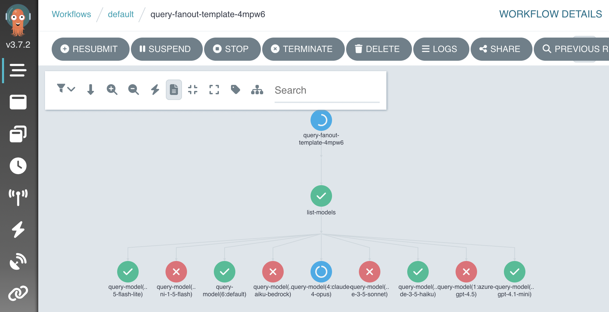
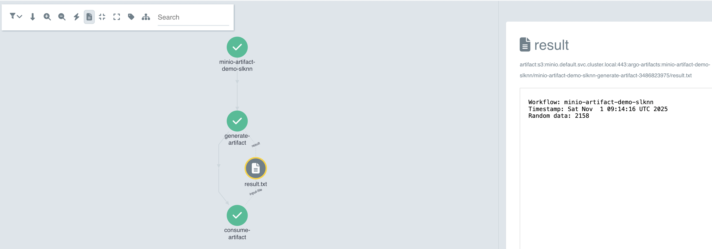
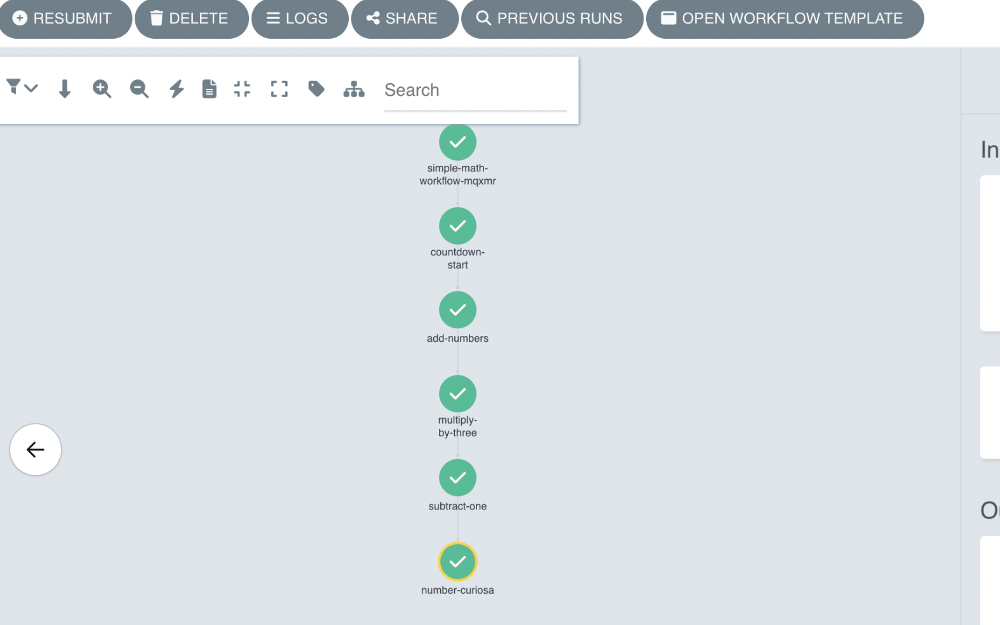

# Argo Workflows

[Argo Workflows](https://argoproj.github.io/) enables multi-step agent operations with parallel execution, conditional logic, and workflow visualization.

Charts that are preconfigured to enable Argo workflows on Ark are available so that you can rapidly build out use cases.

## Installing

This installs Argo in single-namespace mode within the Ark tenant namespace (typically `default` in development mode). Production installations will typically use a cross-tenant Argo operator with workflow execution distributed across Ark tenant namespaces.

Install via Helm, or for local development mode use `devspace`:

```bash
helm upgrade --install argo-workflows \
  oci://ghcr.io/mckinsey/agents-at-scale-ark/charts/argo-workflows

# Or for local development, use devspace:
cd services/argo-workflows
devspace dev

# Check status
kubectl get pods -l app.kubernetes.io/part-of=argo-workflows

# Port-forward to dashboard (this is done automatically when using devspace).
kubectl port-forward svc/argo-workflows-server 2746:2746
# Dashboard: http://localhost:2746
```

### Minio Artifact Storage

Argo Workflows can use Minio for storing workflow artifacts like intermediate outputs, logs, and data files. This is useful for passing data between workflow steps or preserving workflow outputs.

To enable Minio artifact storage, first install the Minio Operator:

```bash
helm upgrade minio-operator operator \
  --install \
  --repo https://operator.min.io \
  --namespace minio-operator \
  --create-namespace \
  --version 7.1.1

# Check status
kubectl get pods -n minio-operator
```

Then enable Minio in the Argo Workflows chart:

```bash
helm upgrade --install argo-workflows \
  oci://ghcr.io/mckinsey/agents-at-scale-ark/charts/argo-workflows \
  --set minio.enabled=true

# Or for local development:
cd services/argo-workflows
devspace dev  # Select 'true' when prompted to enable Minio

# Check Minio tenant status
kubectl get tenant
```

When using `devspace dev`, you'll be prompted whether to enable Minio artifact storage. If enabled, DevSpace automatically installs the Minio Operator and tenant.

## Uninstalling

Uninstall Argo workflows:

```bash
# Uninstall a Helm installation
helm uninstall argo-workflows

# Or purge if using devspace
devspace purge
```

Note: by default, the Argo chart does NOT remove installed CRDs to prevent accidental data deletion. This means re-installing to a different namespace will cause a clash.

To remove Argo CRDs (including `Workflow`, `WorkflowTemplate`, etc.):

```bash
kubectl get crd -o name | grep argoproj.io | xargs kubectl delete
```

This will delete all workflows, templates, and related data from the cluster. Use with caution.

### Uninstalling Minio

If you enabled Minio artifact storage, you can optionally uninstall it:

```bash
# Uninstall Minio Operator
helm uninstall minio-operator --namespace minio-operator
```

Note: Similar to Argo, removing Minio CRDs will delete stored artifacts and data:

```bash
kubectl get crd -o name | grep min.io | xargs kubectl delete
```

## Running Workflows

Start by creating a workflow or workflow template.

A sample template is provided that shows how to run Ark queries:

```bash
kubectl apply -f services/argo-workflows/samples/query-fanout-template.yaml
```

Open the Argo dashboard with at [`http://localhost:2746`](http://localhost:2746) and choose "Workflows > New Workflow > From Template > Query Fanout". The workflow will look something like this when running:



Workflows can also be run using the Argo CLI:

```bash
# List workflow templates if needed.
argo template list

# output:
# NAME
# query-fanout-template

# Run a workflow.
argo submit --from workflowtemplate/query-fanout-template \
  -p question="Describe how to monitor argo workflows from the command-line" \
  -p evaluator-model="default"

# Watch workflow progress
argo watch @latest

# View results, or status of all workflows.
argo logs @latest
argo list workflows
```

This workflow demonstrates how to run Ark and Argo operations:

1. Take input paramters
2. Lists Ark models
3. Fan-out a workflow into a step per model
4. Run Ark queries
5. Fan-in and evalate results (quality, token count, etc)

## Samples

### Ark Tools

The `ark-tools-template.yaml` provides a workflow for running Ark CLI commands in containers. The [`ark-tools`](/reference/utility-images#ark-tools) image includes the Ark CLI pre-installed, enabling workflows to query agents and capture results as workflow outputs.

```bash
kubectl apply -f services/argo-workflows/samples/ark-tools-template.yaml
```

Use this template to integrate Ark agent queries into your workflows without building custom containers.

### Minio Artifacts

The `minio-artifact-template.yaml` demonstrates storing and retrieving artifacts using Minio. This workflow creates an artifact in one step and retrieves it in another, showing how to pass data between workflow steps.

```bash
kubectl apply -f services/argo-workflows/samples/minio-artifact-template.yaml
```

Screenshot:



### A2A Arithmetic Workflow

The `a2a-arithmetic-workflow.yaml` demonstrates combining A2A agents, Ark agents, and Python scripts. The workflow validates prerequisites, performs arithmetic operations, and queries agents for results.

Install [mock-llm](https://github.com/dwmkerr/mock-llm) with A2A support - this will create a simple `countdown-agent` that returns an A2A task that counts down from a given input number of seconds:

```bash
helm upgrade --install mock-llm oci://ghcr.io/dwmkerr/charts/mock-llm \
  --set ark.a2a.enabled=true

# Check the A2A server is ready
kubectl get a2aserver mock-llm-countdown
# NAME                   ADDRESS                                                 READY
# mock-llm-countdown     http://mock-llm:6556/a2a/agents/countdown-agent         true
```

Install and run the workflow:

```bash
kubectl apply -f services/argo-workflows/samples/a2a-arithmetic-workflow.yaml
argo submit --from workflowtemplate/a2a-arithmetic-workflow -p a="2" -p b="3"

# After the workflow runs, check the agent it created
kubectl get agent number-curiosa
# NAME              MODEL     READY
# number-curiosa    default   true
```

Screenshot:



## Troubleshooting

When you get errors or unexpected results:

```bash
# List workflows
kubectl get workflows

# View logs
argo logs @latest
```
