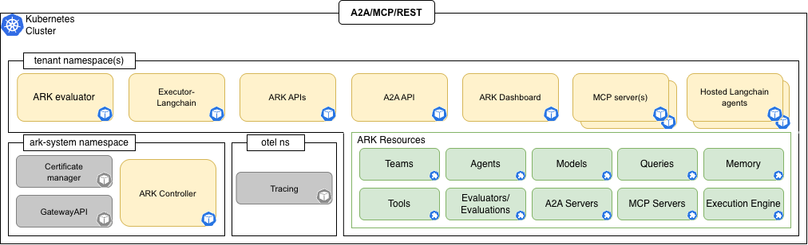

# Ark - Agentic Runtime for Kubernetes

Ark extends Kubernetes with custom resources that make agents, teams, MCP tools, and workflows first-class citizens in your cluster.

Follow the [Quickstart](./quickstart.mdx) guide to install Ark.

> [!NOTE]
>
> The Agents at Scale - Agentic Runtime for Kubernetes ("Ark") Technical Preview should **not** be run without reading the [Disclaimer](./disclaimer.mdx), which covers key risk topics.
>
> We are transitioning this project to our open-source repository. During this process we will be moving documentation URLs, artifact registries, etc. Some builds, artifacts and pipelines may be impacted.

Build, deploy and operate agentic solutions using proven patterns and practices that are reliable for complex distributed systems.

## What is Ark?

ARK codifies patterns and practices developed across dozens of client agentic application projects. These projects span multiple sectors, functions, and technology stacks. Through this experience, we identified recurring challenges around platform-agnostic operations for agentic resources and the need for standardized deployment and management approaches.

This project represents the distillation of those learnings into an open-source runtime. While in early access and rapidly evolving based on ongoing team feedback, ARK provides a foundation built on real-world production experience with agentic systems at scale.

## Architecture

## Core Resources

- **Model**: Define AI model configurations and connection details
- **Agent**: Create autonomous AI agents with specific capabilities and tools
- **Team**: Orchestrate multiple agents working together with coordination strategies
- **Query**: Execute prompts and manage conversations with agents or teams
- **Tool**: Define custom tools and MCP tool references for agents
- **MCPServer**: Configure Model Context Protocol servers for external integrations
- **Memory**: Persistent storage for agent conversations and state
- **Evaluator**: Services for assessing and scoring agent performance
- **Evaluation**: Define evaluation configurations and results
- **ExecutionEngine**: Specialized runtimes for different agent frameworks
- **A2AServer**: Agent-to-agent communication services

## MCP Servers

- **filesystem-mcp**: File system operations and management

## Services

- **ark-api**: REST API for managing ARK resources
- **ark-api-a2a**: Agent-to-agent communication gateway
- **ark-dashboard**: Web-based management interface
- **ark-mcp**: MCP server integration service
- **ark-evaluator**: Holistic evaluation and scoring service
- **localhost-gateway**: Local development gateway
- **ark-cluster-memory**: Memory storage with streaming support

## Sample Services

- **langfuse**: Observability and tracing service
- **executor-langchain**: LangChain agent execution engine

## Credits

The initial design and implementation of Ark was led by [Roman Galeev](https://github.com/Roman-Galeev), [Dave Kerr](https://github.com/dwmkerr), and [Chris Madden](https://github.com/cm94242).
