# Team Strategies

Teams coordinate multiple agents through execution strategies. Each strategy defines how team members interact and process messages.

```mermaid
graph TD
    subgraph "Sequential Strategy"
        S1[Agent 1] --> S2[Agent 2]
        S2 --> S3[Agent 3]
        S3 --> SR[Final Result]
    end

    subgraph "Round Robin Strategy"
        RR_START[Input] --> RR1[Agent A]
        RR1 --> RR2[Agent B]
        RR2 --> RR3[Agent C]
        RR3 --> RR1
        RR1 -. "After Max Turns" .-> RR_END[Max Turns Reached]
    end

    subgraph "Selector Strategy"
        SEL_INPUT[Input] --> SEL_AGENT[Selector Agent]
        SEL_AGENT --> SEL_A[Select Agent A]
        SEL_AGENT --> SEL_B[Select Agent B]
        SEL_AGENT --> SEL_C[Select Agent C]
    end

    subgraph "Graph-Constrained Selector Strategy"
        GCS_INPUT[Input] --> GCS_AGENT[Selector Agent]
        GCS_AGENT --> GCS_CHECK{Graph<br/>Constraints?}
        GCS_CHECK -->|Single Transition| GCS_DIRECT[Direct Selection]
        GCS_CHECK -->|Multiple Transitions| GCS_FILTER[Filter Candidates]
        GCS_FILTER --> GCS_AGENT
        GCS_DIRECT --> GCS_RESULT[Selected Agent]
    end
```




## Sequential Strategy

Executes team members in defined order, passing message history between members.

```yaml
apiVersion: ark.mckinsey.com/v1alpha1
kind: Team
metadata:
  name: sequential-team
spec:
  strategy: sequential
  members:
  - name: agent1
    type: agent
  - name: agent2
    type: agent
```

**Implementation**: `runtime/internal/genai/team.go:53`
- Processes members one by one in array order
- Each member receives complete message history from previous members
- Execution stops on first error or termination

## Round-Robin Strategy

Cycles through team members repeatedly until maxTurns limit or team termination.

```yaml
apiVersion: ark.mckinsey.com/v1alpha1
kind: Team
metadata:
  name: roundrobin-team
spec:
  strategy: round-robin
  maxTurns: 3
  members:
  - name: agent1
    type: agent
  - name: agent2
    type: agent
```

**Implementation**: `runtime/internal/genai/team.go:67`
- Continuously cycles through all members
- Requires `maxTurns` to prevent infinite loops
- Each turn processes all members in sequence
- Maintains turn counter and message history across cycles
- Use terminate tool to end execution early

## Selector Strategy

AI agent chooses next participant based on conversation context.

```yaml
apiVersion: ark.mckinsey.com/v1alpha1
kind: Team
metadata:
  name: selector-team
spec:
  strategy: selector
  maxTurns: 10
  selector:
    agent: coordinator
    selectorPrompt: |
      Choose the best participant for the next response.
      Available: {{.Participants}}
      History: {{.History}}
  members:
  - name: researcher
    type: agent
  - name: writer
    type: agent
```

**Implementation**: `runtime/internal/genai/team_selector.go:66`
- Uses AI agent to select next participant
- Template-based prompts with conversation history
- Fallback to first member if selection fails
- Prevents consecutive execution by same member
- Use terminate tool to end execution early

### Selector Template Variables
- `{{.Participants}}`: Comma-separated member names
- `{{.Roles}}`: Member names with descriptions
- `{{.History}}`: Formatted conversation history

## Graph Strategy

Directed workflow execution following defined transitions.

```yaml
apiVersion: ark.mckinsey.com/v1alpha1
kind: Team
metadata:
  name: graph-team
spec:
  strategy: graph
  maxTurns: 5
  members:
  - name: researcher
    type: agent
  - name: analyzer
    type: agent
  - name: writer
    type: agent
  graph:
    edges:
    - from: researcher
      to: analyzer
    - from: analyzer
      to: writer
```

**Implementation**: `runtime/internal/genai/team_graph.go:10`
- Follows directed graph edges for member transitions
- Starts with first member in members array
- Execution stops when no outgoing edge exists or team termination
- Requires `maxTurns` to prevent infinite cycles
- Use terminate tool to end execution early

## Graph-Constrained Selector Strategy

Combines AI-driven selection with workflow constraints. The selector agent chooses the next participant, but only from members allowed by the graph edges.

```yaml
apiVersion: ark.mckinsey.com/v1alpha1
kind: Team
metadata:
  name: graph-selector-team
spec:
  strategy: selector
  maxTurns: 10
  selector:
    agent: coordinator
  members:
    - name: researcher
      type: agent
    - name: analyzer
      type: agent
    - name: writer
      type: agent
  graph:
    edges:
      - from: researcher
        to: analyzer
      - from: researcher
        to: writer
      - from: analyzer
        to: writer
```

**Implementation**: `runtime/internal/genai/team_selector.go:237`
- Uses selector agent to choose next participant
- Graph constraints limit available candidates
- Single legal transition: skips selector agent (optimization)
- Multiple legal transitions: selector agent chooses from candidates
- No legal transitions: falls back to first member
- Combines flexibility of AI selection with structure of graph workflows

### How It Works

1. **Graph Constraint Lookup**: After each member executes, system looks up legal transitions from that member
2. **Candidate Filtering**: If multiple transitions exist, selector agent chooses from only those candidates
3. **Optimization**: If only one legal transition exists, system uses it directly without calling selector agent
4. **AI Selection**: Selector agent analyzes conversation and chooses best candidate from filtered list
5. **Execution**: Selected member processes messages and adds response

### Use Cases

- **Workflow with Flexibility**: Define required workflow structure but allow AI to choose between valid options
- **Branching Workflows**: Multiple valid paths where AI selects the best route
- **Quality Gates**: Ensure certain steps happen in order while allowing flexibility elsewhere

### Example: Research Workflow

```yaml
spec:
  strategy: selector
  selector:
    agent: coordinator
  members:
    - name: researcher
      type: agent
    - name: analyzer
      type: agent
    - name: reviewer
      type: agent
    - name: writer
      type: agent
  graph:
    edges:
      # Coordinator can start with researcher or analyzer
      - from: coordinator
        to: researcher
      - from: coordinator
        to: analyzer
      # Researcher must go to analyzer
      - from: researcher
        to: analyzer
      # Analyzer can go to reviewer or writer
      - from: analyzer
        to: reviewer
      - from: analyzer
        to: writer
      # Reviewer must go to writer
      - from: reviewer
        to: writer
```

In this example:
- Coordinator AI chooses initial path (researcher or analyzer)
- Researcher always flows to analyzer (required step)
- Analyzer AI chooses between reviewer or writer (flexibility)
- Reviewer always flows to writer (required step)

## Team Composition

### Nested Teams
Teams can contain other teams as members:

```yaml
spec:
  members:
  - name: sub-team
    type: team
  - name: agent1
    type: agent
```

### Member Types
- `agent`: Individual AI agent
- `team`: Nested team with its own strategy

## Configuration Options

### Common Settings
- `maxTurns`: Maximum execution cycles (required for round-robin, selector, graph)
- `description`: Team description used in selector templates
- `members`: Array of TeamMember objects

### Strategy-Specific Settings
- **Selector**: `selector.agent`, `selector.selectorPrompt`
- **Graph**: `graph.edges` array with `from`/`to` references

## Error Handling

All strategies support:
- Graceful termination via `TerminateTeam` error
- Message history preservation on errors
- Turn tracking and limits
- Event recording for observability

## Early Termination

Agents can use the terminate tool to end team execution early:

```yaml
apiVersion: ark.mckinsey.com/v1alpha1
kind: Agent
metadata:
  name: coordinator
spec:
  prompt: "You coordinate the team. Use terminate tool when task is complete."
  tools:
  - name: terminate
    type: built-in
```

The terminate tool stops team execution and returns current results without processing remaining members or turns.

## Sample Files

- Basic sequential: `samples/team.yaml`
- Graph workflow: `samples/team-graph.yaml`
- GitHub integration: `samples/teams/github-team.yaml`
- Selector strategy: `samples/selector-strategy-test.yaml`