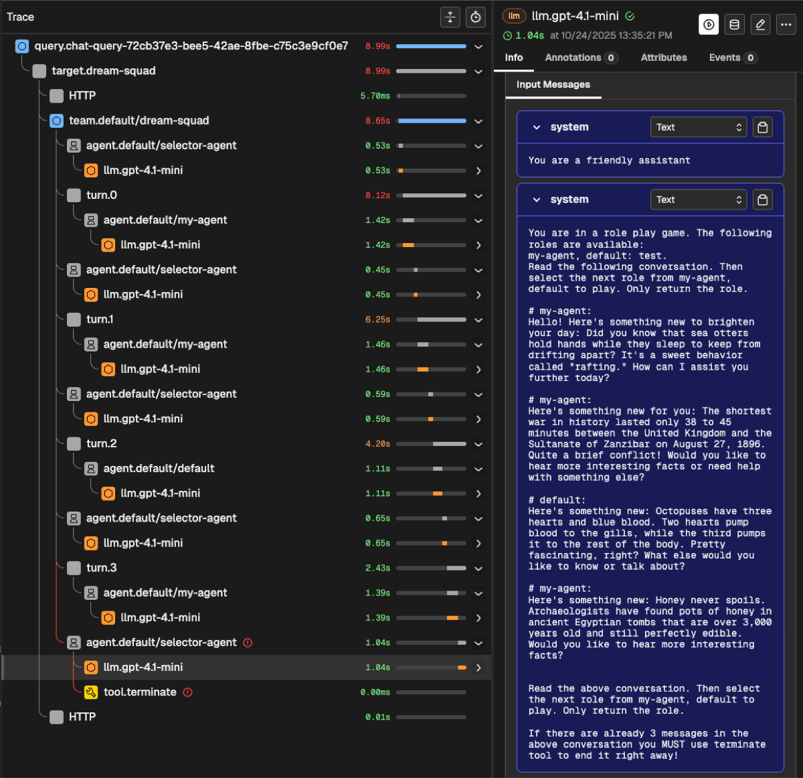

# Phoenix

[Arize Phoenix](https://docs.arize.com/phoenix) is an open-source AI/ML observability and evaluation platform that provides comprehensive tracing, performance monitoring, and model evaluation capabilities.

## Overview

Phoenix integration with ARK provides:

- **OpenTelemetry Tracing**: Automatic trace collection from ARK agents and services
- **LLM Observability**: Track token usage, latency, and model performance
- **Evaluation Framework**: Assess agent responses and behavior
- **Interactive Dashboard**: Visualize traces, metrics, and evaluation results
- **Multi-namespace Support**: OTEL environment variables automatically configured



## Quick Start

### Installation

**Using DevSpace (Recommended for Development):**
```bash
cd marketplace/services/phoenix
devspace deploy
```

**Note**: DevSpace automatically restarts the ARK controller after deployment to ensure it picks up the new Phoenix configuration.

**Using Helm:**
```bash
cd marketplace/services/phoenix
helm dependency update chart/
helm install phoenix ./chart -n phoenix --create-namespace
```

### Access Dashboard

**With DevSpace:**
```bash
cd marketplace/services/phoenix
devspace dev
# Then port-forward to access dashboard:
kubectl port-forward -n phoenix svc/phoenix-svc 6006:6006
# Open http://localhost:6006
```

**With kubectl:**
```bash
kubectl port-forward -n phoenix svc/phoenix-svc 6006:6006
# Open http://localhost:6006
```

## Configuration

### Default Configuration

Phoenix is deployed with these defaults:
- **Namespace**: `phoenix`
- **Service Name**: `phoenix-svc`
- **Port**: `6006`
- **OTEL Endpoint**: `http://phoenix-svc.phoenix.svc.cluster.local:6006/v1/traces`

### OTEL Environment Variables

Phoenix automatically creates Kubernetes secrets with OTEL environment variables in configured namespaces (default: `ark-system` and `default`).

The secret `otel-environment-variables` contains:
```yaml
PHOENIX_COLLECTOR_ENDPOINT: http://phoenix-svc.phoenix.svc.cluster.local:6006
PHOENIX_CLIENT_HEADERS: ""
PHOENIX_PROJECT_NAME: default
```

### Using OTEL Secrets in Deployments

Add to your deployment's container spec:
```yaml
envFrom:
  - secretRef:
      name: otel-environment-variables
      optional: true
```

**Note**: When using DevSpace, the ARK controller is automatically restarted after Phoenix deployment. For manual deployments, existing deployments must be restarted to pick up new/updated secrets:
```bash
# Only needed for manual deployments (not DevSpace)
kubectl rollout restart deployment/ark-controller -n ark-system
```

### Custom Configuration

Customize Phoenix by modifying `chart/values.yaml`:

```yaml
# Enable HTTPRoute for Gateway API routing
httpRoute:
  enabled: true
  hostnames:
    - "phoenix.example.com"

# Add OTEL secrets to additional namespaces
otelEnvironmentVariableSecrets:
  enabled: true
  namespaces:
    - ark-system
    - default
    - my-custom-namespace

# Configure Phoenix settings
phoenix-helm:
  auth:
    enableAuth: true  # Enable authentication
  service:
    type: LoadBalancer  # Expose externally
```

## Troubleshooting

### Dashboard Not Accessible

Check if Phoenix is running:
```bash
kubectl get pods -n phoenix
kubectl get svc -n phoenix
```

Verify port-forwarding:
```bash
kubectl port-forward -n phoenix svc/phoenix-svc 6006:6006
```

### No Traces Appearing

1. Verify OTEL endpoint is configured correctly
2. Check that applications are instrumented with OpenTelemetry
3. Ensure OTEL secrets are mounted in your deployments
4. When using manual deployment methods, restart deployments after updating secrets:
   ```bash
   # Only needed for manual deployments (DevSpace handles this automatically)
   kubectl rollout restart deployment/ark-controller -n ark-system
   ```

### OTEL Secrets Not Created

Check if the secret exists:
```bash
kubectl get secret otel-environment-variables -n ark-system
```

If missing, verify `otelEnvironmentVariableSecrets.enabled: true` in `values.yaml` and redeploy.

## Uninstallation

**Using DevSpace:**
```bash
cd marketplace/services/phoenix
devspace purge
```

**Using Helm:**
```bash
helm uninstall phoenix -n phoenix
kubectl delete namespace phoenix  # Optional: remove namespace
```

## Additional Resources

- [Phoenix Documentation](https://docs.arize.com/phoenix)
- [OpenTelemetry Documentation](https://opentelemetry.io/docs/)
